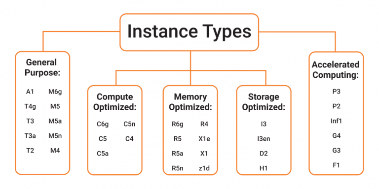

# AWS: Cloud Servers

## Amazon EC2

An Amazon EC2 instance is a virtual server in Amazon's Elastic Compute Cloud (EC2) for running applications on the Amazon Web Services (AWS) infrastructure.

Instance Types of Amazon EC2

## EC2 instance types

* General purpose: A general purpose instance is a VM that is designed to handle a variety of workloads. General purpose instances are optimized to have a high number of CPU cores, on-demand storage and memory.

* Compute optimized: Compute optimized instances are used to run big data applications that require large amounts of processing power and memory on the AWS cloud. These instances are designed and optimized for running computational and data-intensive applications that require fast network performance, extensive availability and high input/output (I/O) operations per second (IOPS). Examples of types of applications includes scientific and financial modeling and simulation, machine learning, enterprise data warehousing and business intelligence.

* Graphics processing unit (GPU): These instances provide a way to run graphics-intensive applications faster than with the standard EC2 instances. Systems that rely on GPUs include gaming and design work

* Memory optimized: Memory optimized instances use a high-speed, solid-state drive to provide ultra-fast access to data and deliver high performance.

* Storage optimized: Storage optimized instances are ideal for applications that require high I/O performance, such as NoSQL databases that store and retrieve data in real time. They're also well suited for memory-intensive applications such as data processing, data warehousing, analytics workloads and log processing.

* Micro: A micro instance is meant for applications with low throughput. The micro instance type can serve as a small database server, as a platform for software testing or as a web server that does not require high transaction rates.

## Use cases

* Run cloud-native and enterprise applications

Amazon EC2 delivers secure, reliable, high-performance, and cost-effective compute infrastructure to meet demanding business needs.

* Scale for HPC applications

Access the on-demand infrastructure and capacity you need to run HPC applications faster and cost-effectively.

### Reasons to use EC2 instead of Heroku

* Heroku is container-base cloud platform offering (PaaS) whereas AWS is a secure cloud services platform providing IaaS, PaaS and SaaS.

## EC2 FOR Humans

1- we can finde EC2 by  click on EC2 in Compute 
2- click on Launch Instance 
3- and then select your machine
