## Express REST API

1 .Review: ES6 Classes   
2 .Using Express Routing  
3 .Express Routing   

## 1.Review: ES6 Classes  

## **A JavaScript class is not an object.

## It is a template for JavaScript objects.**

## Classes>>  
Classes are a template for creating objects.

## Class declarations 
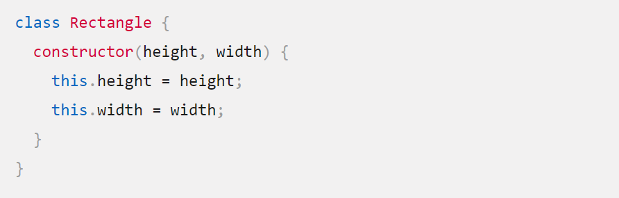
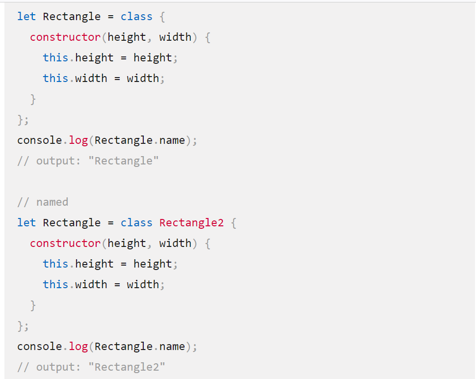
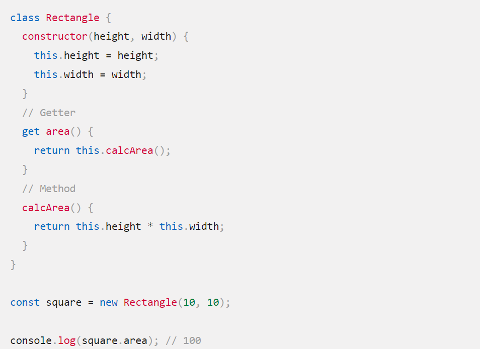

## 2.***Routing***
refers to how an application’s endpoints (URIs) respond to client requests.

## Route methods: 
A route method is derived from one of the HTTP methods, and is attached to an instance of the express class. 
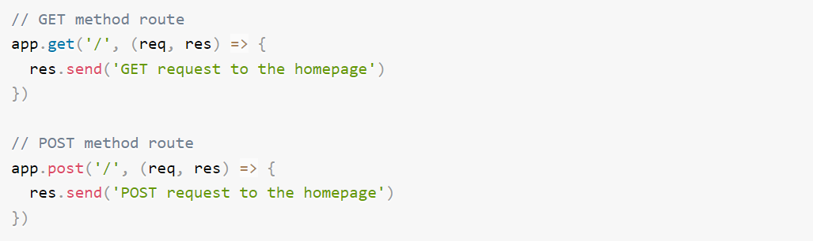

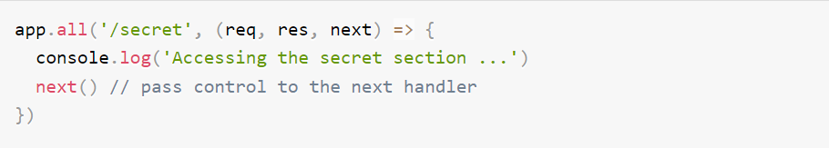

## Route paths:
Route paths, in combination with a request method, define the endpoints at which requests can be made. Route paths can be strings, string patterns, or regular expressions.

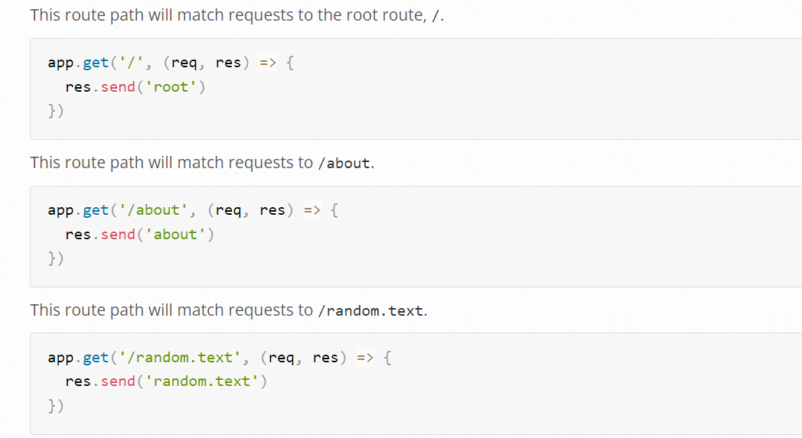
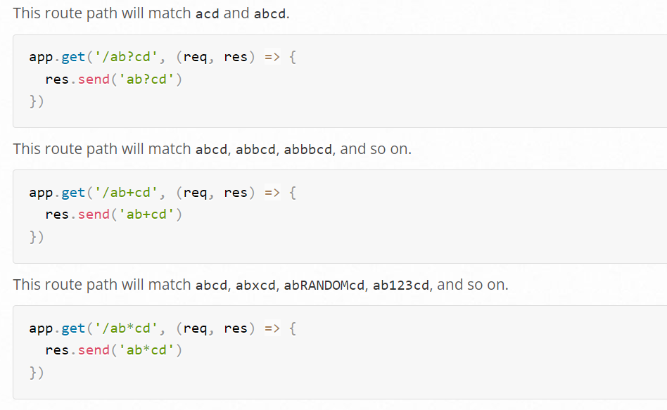
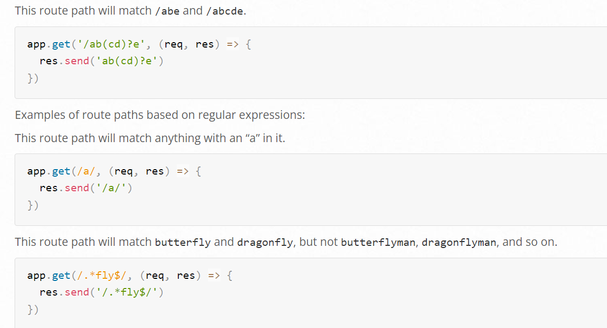

## Route parameters:
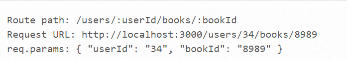

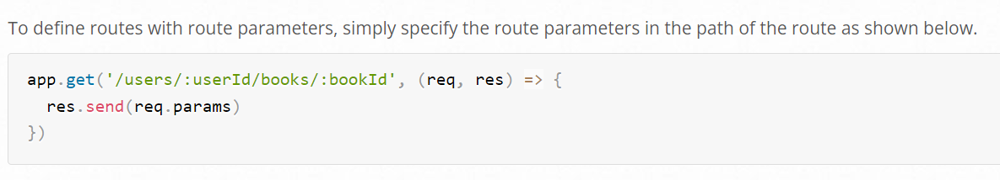

## Route handlers: 
You can provide multiple callback functions that behave like middleware to handle a request.

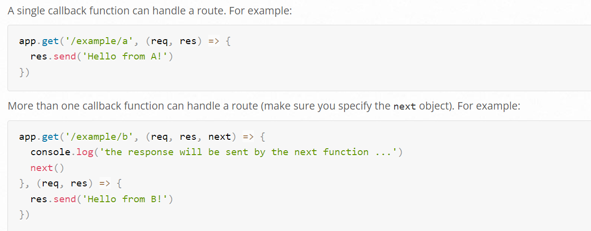

## Response Methods:
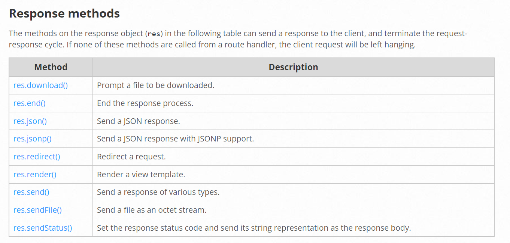

 
 

[Back to the main page](README.md)