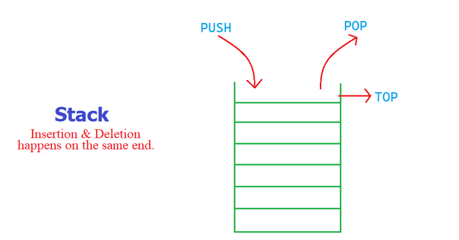

# Stack 

### Stack is a linear data structure which follows a particular order in which the operations are performed. The order may be LIFO(Last In First Out) or FILO(First In Last Out).

## Introduction

Mainly the following four basic operations are performed in the stack:

#### Push: Adds an item to the stack. If the stack is full, then it is said to be an Overflow condition.

##### Algorithm for push:

begin
 if stack is full
    return
 endif
else  
 increment top
 stack[top] assign value
end else
end procedure

#### Pop: Removes an item from the stack. The items are popped in the reversed order in which they are pushed. If the stack is empty, then it is said to be an Underflow condition.

##### Algorithm for pop:

begin
 if stack is empty
    return
 endif
else
 store value of stack[top]
 decrement top
 return value
end else
end procedure

#### Peek or Top: Returns the top element of the stack.

##### Algorithm for isEmpty:

begin
 if top < 1
    return true
 else
    return false
end procedure

# Queue

## A Queue is a linear structure which follows a particular order in which the operations are performed. The order is First In First Out (FIFO). A good example of a queue is any queue of consumers for a resource where the consumer that came first is served first. The difference between stacks and queues is in removing. In a stack we remove the item the most recently added; in a queue, we remove the item the least recently added.

## Basic Operations on Queue: 

* void enqueue(int data): Inserts an element at the end of the queue i.e. at the rear end.
* int dequeue(): This operation removes and returns an element that is at the front end of the queue.

## Auxiliary Operations on Queue:

* int front(): This operation returns the element at the front end without removing it.
* int rear(): This operation returns the element at the rear end without removing it.
* int isEmpty(): This operation indicates whether the queue is empty or not.
* int size(): This operation returns the size of the queue i.e. the total number of elements it contains. 

### Types of Queues: 

* Simple Queue: Simple queue also known as a linear queue is the most basic version of a queue. Here, insertion of an element i.e. the Enqueue operation takes place at the rear end and removal of an element i.e. the Dequeue operation takes place at the front end.
* Circular Queue:  In a circular queue, the element of the queue act as a circular ring. The working of a circular queue is similar to the linear queue except for the fact that the last element is connected to the first element. Its advantage is that the memory is utilized in a better way. This is because if there is an empty space i.e. if no element is present at a certain position in the queue, then an element can be easily added at that position.
* Priority Queue: This queue is a special type of queue. Its specialty is that it arranges the elements in a queue based on some priority. The priority can be something where the element with the highest value has the priority so it creates a queue with decreasing order of values. The priority can also be such that the element with the lowest value gets the highest priority so in turn it creates a queue with increasing order of values.
* Dequeue: Dequeue is also known as Double Ended Queue. As the name suggests double ended, it means that an element can be inserted or removed from both the ends of the queue unlike the other queues in which it can be done only from one end. Because of this property it may not obey the First In First Out property. 

