# SQL !

* Exercise 1
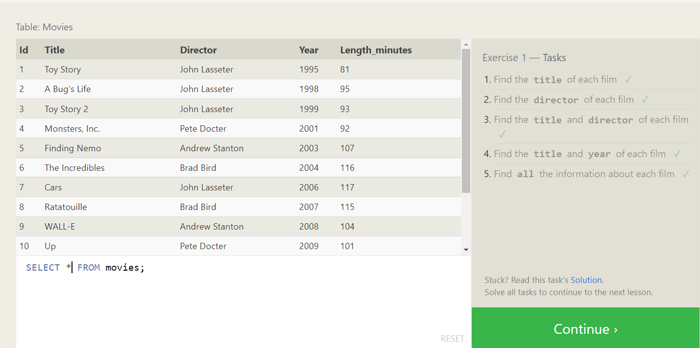

* Exercise 2
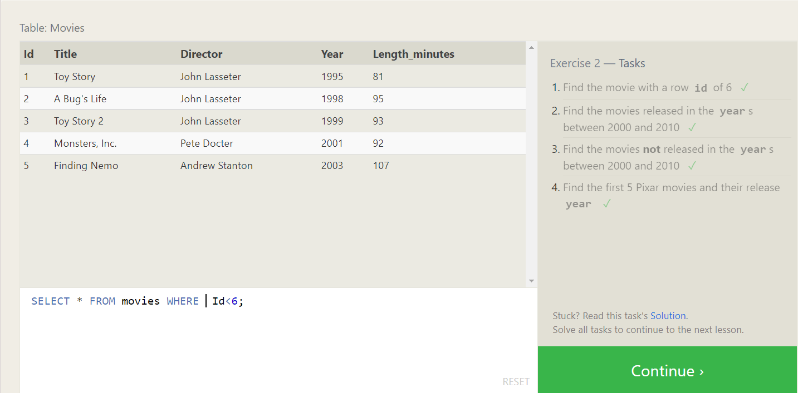

* Exercise 3
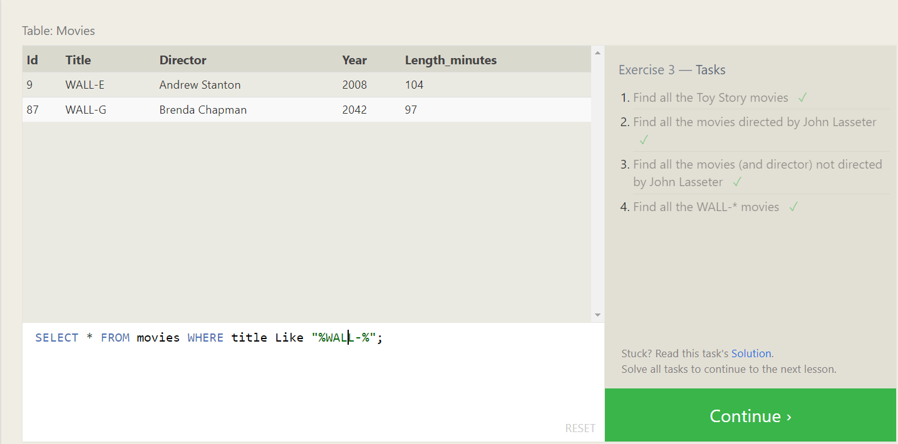

* Exercise 4
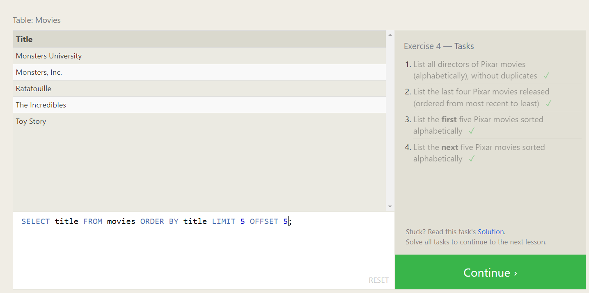

* Exercise 6
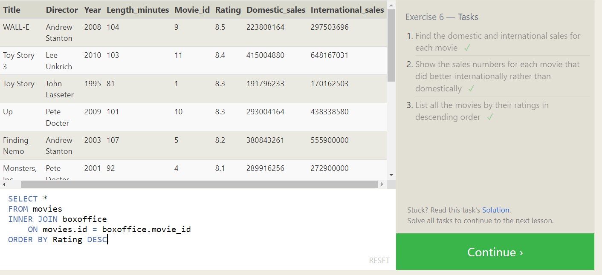

* Exercise 13
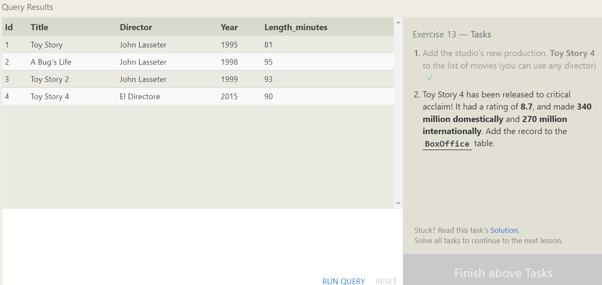

* Exercise 14
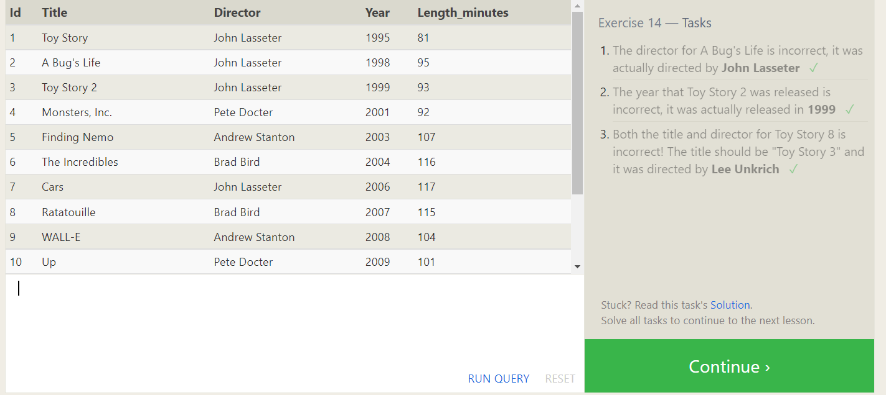

* Exercise 15
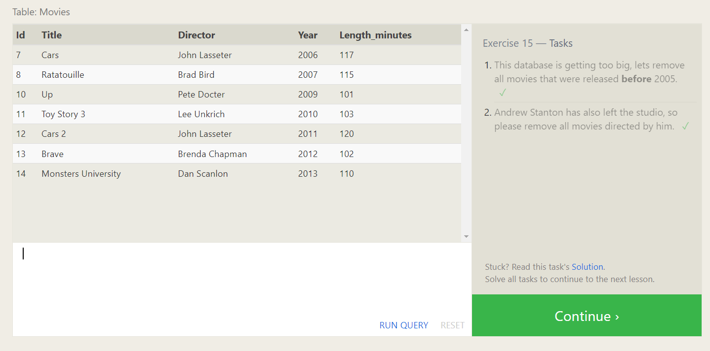

* Exercise 16
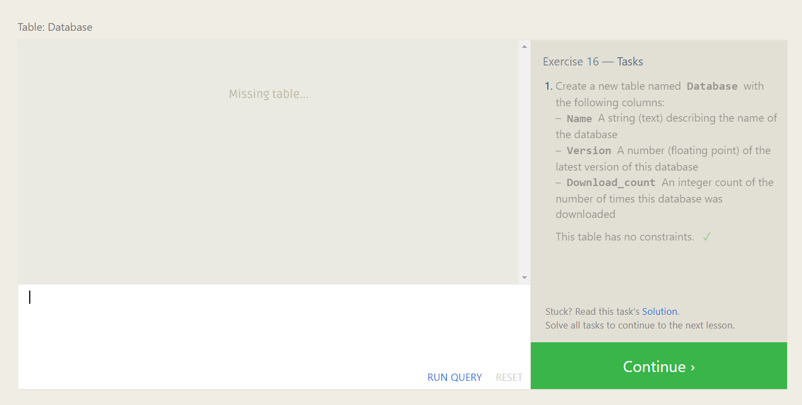

* Exercise 17
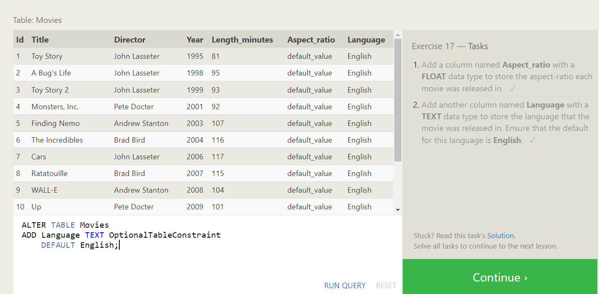

* Exercise 18
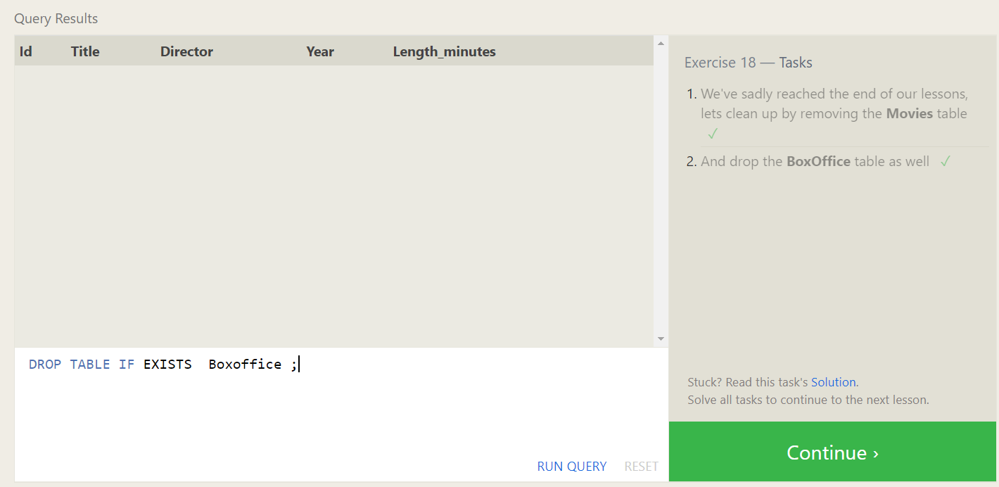

 

##  [Next>](terminal.md)     
## [<Back](README.md)
