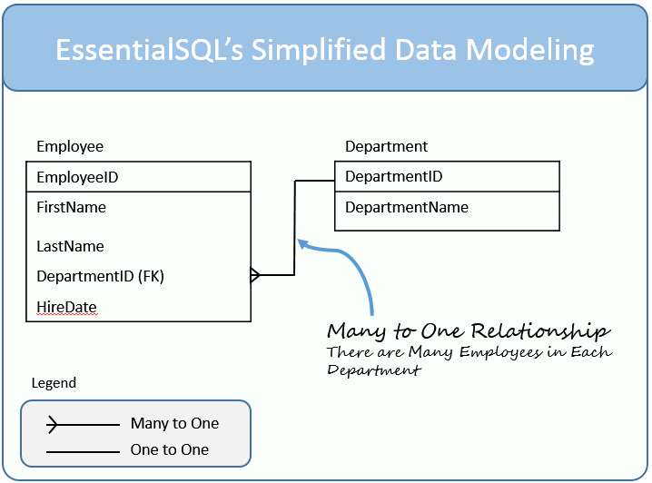

# SQL 

## SQL vs NoSQL
* SQL ->SQL databases are primarily called as Relational Databases (RDBMS).
* NoSQL -> database are primarily called as non-relational or distributed database.
### More Deferance
SQL databases are table based databases whereas NoSQL databases are document based, key-value pairs, graph databases or wide-column stores. This means that SQL databases represent data in form of tables which consists of n number of rows of data whereas NoSQL databases are the collection of key-value pair, documents, graph databases or wide-column stores which do not have standard schema definitions which it needs to adhered to.

SQL databases have predefined schema whereas NoSQL databases have dynamic schema for unstructured data.

### example of SQL
- MySql, Oracle, Sqlite, Postgres and MS-SQL.

### example of NOSQL 
- MongoDB, BigTable, Redis, RavenDb, Cassandra, Hbase, Neo4j and CouchDb

### SQL Database Examples

1- MySQL Community Edition
* MySQL database is very popular open-source database. It is generally been stacked with apache and PHP, although it can be also stacked with nginx and server side javascripting using Node js.

### NoSQL Database Examples
1-  MongoDB
* Mongodb is one of the most popular document based NoSQL database as it stores data in JSON like documents. It is non-relational database with dynamic schema. It has been developed by the founders of DoubleClick, written in C++ and is currently being used by some big companies like The New York Times, Craigslist, MTV Networks

# Data Modeling – Table Elements

The diagram above shows my method to model a relational database table.  The major elements that are depicted include:

The <<Table>Name, which is located at the top of the table.
The <Primary Keys>  Remember the primary keys uniquely identify each row in a table.  A table typically has one primary key, but can have more.  When the key has more than one column, it is called a compound key.
<Table Columns> – There can be one or more table columns.  To keep the diagrams simple, I don’t show the data types.  I may introduce those later when we focus on more comprehensive modeling.
<Foreign Key> – This is a column or set of columns which match a primary key in another table.

> **_NOTE:_**  Sequelize is a promise-based Node.js ORM tool for Postgres, MySQL, MariaDB, SQLite, Microsoft SQL Server, Amazon Redshift and Snowflake’s Data Cloud. It features solid transaction support, relations, eager and lazy loading .