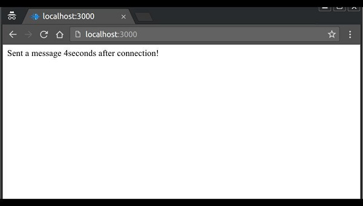

# WebSocket

## Whats is websocket?
websocket : is a computer communications protocol, providing full-duplex communication channels over a single TCP connection. The WebSocket protocol was standardized by the IETF as RFC 6455 in 2011.

The WebSocket protocol enables interaction between a web browser (or other client application) and a web server with lower overhead than half-duplex alternatives such as HTTP polling, facilitating real-time data transfer from and to the server.

## JavaScript client example

```
// Creates new WebSocket object with a wss URI as the parameter
const socket = new WebSocket('wss://game.example.com/ws/updates');

// Fired when a connection with a WebSocket is opened
socket.onopen = function () {
  setInterval(function() {
    if (socket.bufferedAmount == 0)
      socket.send(getUpdateData());
  }, 50);
};

// Fired when data is received through a WebSocket
socket.onmessage = function(event) {
  handleUpdateData(event.data);
};

// Fired when a connection with a WebSocket is closed
socket.onclose = function(event) {
  onSocketClose(event);
};

// Fired when a connection with a WebSocket has been closed because of an error
socket.onerror = function(event) {
  onSocketError(event);
};
```

## Web server implementation

To establish a WebSocket connection, the client sends a WebSocket handshake request, for which the server returns a WebSocket handshake response, as shown in the example below.[39]

Client request (just like in HTTP, each line ends with \r\n and there must be an extra blank line at the end):

```
GET /chat HTTP/1.1
Host: server.example.com
Upgrade: websocket
Connection: Upgrade
Sec-WebSocket-Key: x3JJHMbDL1EzLkh9GBhXDw==
Sec-WebSocket-Protocol: chat, superchat
Sec-WebSocket-Version: 13
Origin: http://example.com
```

## Server response:

```
HTTP/1.1 101 Switching Protocols
Upgrade: websocket
Connection: Upgrade
Sec-WebSocket-Accept: HSmrc0sMlYUkAGmm5OPpG2HaGWk=
Sec-WebSocket-Protocol: chat
```

### ExpressJS
We will be using express to build the web server that Socket.IO will work with. Any other node-server-side framework or even node HTTP server can be used. However, ExpressJS makes it easy to define routes and other things. To read more about express and get a basic idea about it, head to – [ExpressJS tutorial](https://www.tutorialspoint.com/expressjs/index.htm).

##  example to handle events using SocketIO library.

```
In the Hello World example, we used the connection and disconnection events to
log when a user connected and left. Now we will be using the message event to
pass message from the server to the client. To do this, modify the io.on
('connection', function(socket)) as shown below –var app =
require('express')();
var http = require('http').Server(app);
var io = require('socket.io')(http);

app.get('/', function(req, res){
   res.sendFile('E:/test/index.html');
});
 
io.on('connection', function(socket){
   console.log('A user connected');
 
   // Send a message after a timeout of 4seconds
   setTimeout(function(){
      socket.send('Sent a message 4seconds after connection!');
   }, 4000);
   socket.on('disconnect', function () {
      console.log('A user disconnected');
   });
});
http.listen(3000, function(){
   console.log('listening on *:3000');
});
```

Now, we need to handle this event on our client side, to do so, replace the contents of the index.html page with the following −

```
<!DOCTYPE html>
<html>
   <head><title>Hello world</title></head>
   <script src="/socket.io/socket.io.js"></script>
   <script>
      var socket = io();
      socket.on('message', function(data){document.write(data)});
   </script>
   <body>Hello world</body>
</html>
```
We are now handling the 'message' event on the client. When you go to the page in your browser now, you will be presented with the following screenshot.


After 4 seconds pass and the server sends the message event, our client will handle it and produce the following output −



## Difference Between WebSocket and Socket.io

**WebSocket :** is the communication Protocol that provides bidirectional communication between the Client and the Server over a TCP connection; WebSocket remains open all the time, so they allow real-time data transfer. When clients trigger the request to the server, it does not close the connection on receiving the response; it rather persists and waits for the Client or server to terminate the request.

**Socket.IO :** is a library that enables real-time and full-duplex communication between the Client and the Web servers. It uses the WebSocket protocol to provide the interface. Generally, it is divided into two parts; both WebSocket vs Socket.io are event-driven libraries.

Client-Side: it is the library that runs inside the browser
Server Side: It is the library for Node.js